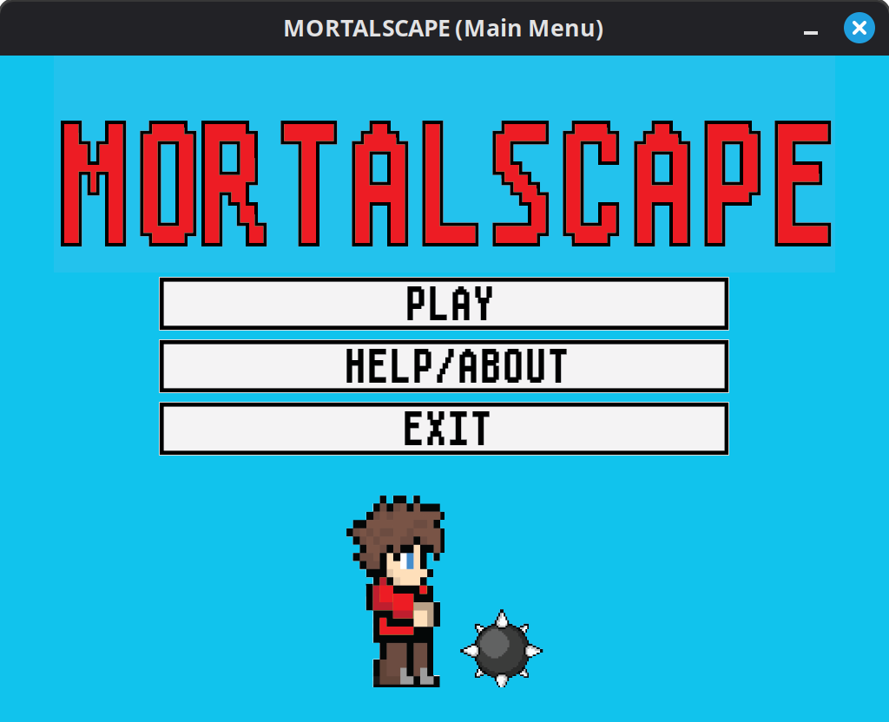
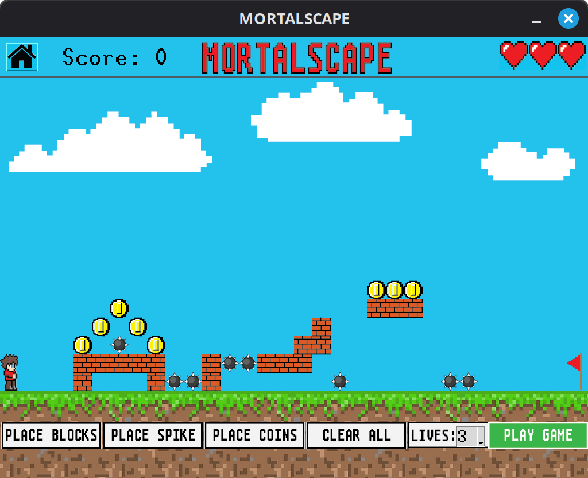

# Mortalscape

## About

This game is a 2D-platformer with a custom level editor. You can place blocks, coins and spikes anywhere on the screen and play through your level. Grab coins to increase your score and reach the flag at the end to beat your level!





This game is made with Python, Pygame for audio output, and Tkinter for the GUI (W stack). I made this game over the course of a weekend as part of a school project involving learning Python and Tkinter.

Because of the rapid devlopment and the W tech stack, I wasn't able to make this game as fleshed out as I had originally wanted. Key features are missing (e.g. level saving, enemy AI, etc.), and many parts of the game had to be rushed (namely the movement system). I would like to revisit this project some day and do it justice with a full rewrite using C++ and SDL2.

## Setup

#### Clone the repository:

```
git clone https://github.com/seaflop/Mortalscape
```

#### Navigate to the `Mortalscape` directory:

```
cd Mortalscape
```

#### Activate a Python virutal environment:

Windows:

```
python -m venv .venv
.venv\Scripts\Activate
```

POSIX:

```
python3 -m venv .venv
source .venv/bin/activate
```

#### Install the required packages (just pygame):

```
pip install --upgrade pip
pip install -r requirements.txt
```

#### Run the `mortalscape.py` file:

```
python mortalscape.py
```